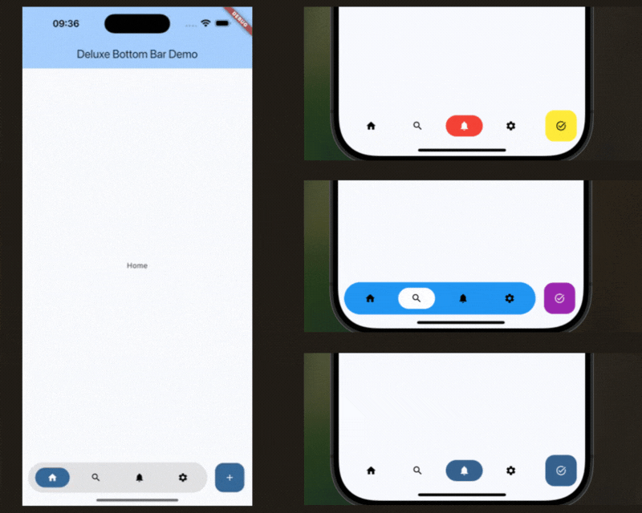

# Deluxe Bottom Bar

[](https://pub.dev/packages/deluxe_bottom_bar)

Deluxe Bottom Bar is a Flutter package that provides a customizable bottom navigation bar for your Flutter applications.

## Features

* Customizable icons and labels
* Easy to integrate



## Getting Started

To use this package, add `deluxe_bottom_bar` as a dependency in your `pubspec.yaml` file.

```yaml
dependencies:
  deluxe_bottom_bar: any
```

## Usage

```dart
import 'package:flutter/material.dart';
import 'package:deluxe_bottom_bar/deluxe_bottom_bar.dart';

void main() {
  runApp(MyApp());
}

class MyApp extends StatelessWidget {
  @override
  Widget build(BuildContext context) {
    final PageController pageController = PageController();

    return MaterialApp(
      home: Scaffold(
        appBar: AppBar(
          title: const Text('Deluxe Bottom Bar Example'),
        ),
        body: PageView(
          controller: pageController,
          children: const [
            Center(child: Text('Home Page')),
            Center(child: Text('Search Page')),
            Center(child: Text('Flutter Page')),
            Center(child: Text('Settings Page')),
          ],
        ),
        bottomNavigationBar: DeluxeBottomBar(
          pageController: pageController,
          style: const DeluxeBottomBarStyle(
            backgroundColor: Colors.white,
            boxShadow: [
              BoxShadow(
                color: Color.fromRGBO(171, 171, 171, .7),
                blurRadius: 10,
                offset: Offset(0, 5),
              ),
            ],
          ),
          buttonStyle: const DeluxeBottomBarButtonStyle(
            selectedButtonBackgroundColor: Color(0xff0ebe7e),
            iconSize: 22,
            selectedButtonIconColor: Colors.white,
          ),
          actionButtonStyle: const DeluxeBottomBarActionButtonStyle(
            backgroundColor: Color(0xff0ebe7e),
            widget: Icon(
              Icons.accessibility_new_rounded,
              color: Colors.white,
            ),
          ),
          items: const [
            DeluxeBottomBarItem(
              icon: Icon(
                Icons.home_outlined,
              ),
            ),
            DeluxeBottomBarItem(
              icon: Icon(
                Icons.search_outlined,
              ),
              tooltip: 'Search',
            ),
            DeluxeBottomBarItem(
              icon: FlutterLogo(
                size: 20,
              ),
              tooltip: 'Flutter',
            ),
            DeluxeBottomBarItem(
              icon: Icon(
                Icons.settings_outlined,
              ),
              tooltip: 'Settings',
            ),
          ],
        ),
      ),
    );
  }
}

```

## Example

you can find the example in the [Example](/example) folder.

## Contributing

Contributions are welcome! If you'd like to contribute, please fork the repository and submit a pull request.

## License

This project is licensed under the MIT License - see the [LICENSE](LICENSE) file for details.
